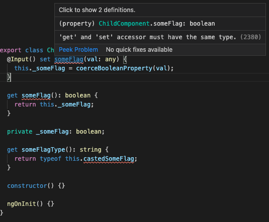

# Day 42: Có thể bạn đã biết - Angular CDK Coercion

Sau hai tutorial với Jira clone, hôm nay chúng ta sẽ đổi gió tìm hiểu thêm một chút về Angular CDK Coercion, một bộ API rất hữu dụng nhưng rất tiếc chưa có documentation chi tiết 🤣

## Angular CDK Coercion là gì?

Trong AngularCDK có 1 bộ utilities functions **coercion**. Nếu các bạn build Angular Libraries và các bạn muốn bảo đảm các Input được devs truyền vào được đúng kiểu dữ liệu thì những utilities này sẽ rất tuyệt vời.

> Coercion is the process of implicitly converting data to a required format.

Coercion là quá trình chuyển một input đầu vào thành kiểu tương ứng. Nếu bạn làm việc với JS thì sẽ nhìn thấy khá nhiều ví dụ quen thuộc, có hai kiểu coercion là `Implicit` và `Explicit`

### Implicit coercion

Ví dụ trong operator `1 + '1'`, vì number và string không cùng một kiểu dữ liệu nên khi thực hiện operator `+`, JS sẽ `ngấm ngầm` convert số 1 thành string `1` và output sẽ là string `11` chứ không phải number `2`.

Hay ngay cả khi dùng `if ('trung') {}`, vì `'trung'` là string, không phải là boolean nên JS cũng đã ngầm convert string type đó sang boolean cho bạn.

### Explicit coercion

Ví dụ ở trên khi mình sửa lại thành `if (Boolean('string')) {}` thì là mình muốn nói JS hãy convert string thành boolean để check thay vì để JS tự làm công việc đấy, thì đây là explicit. Hay còn gọi là type casting.

Tóm tắt lại là Implicit (ngầm) >< Explicit (không ngầm 😂 )

### Angular CDK Coercion có gì hay?

Angular CDK Coercion bao gồm:

- coerceArray
- coerceBooleanProperty
- coerceCssPixelValue
- coerceElement
- coerceNumberProperty
- coerceStringArray

Anh em có thể tìm hiểu thêm tại [src/cdk/coercion][src/cdk/coercion]

## coerceBooleanProperty

Mình sẽ demo một loại trong này là `coerceBooleanProperty` vì demo này giúp cho các bạn thay đổi cách truyền `boolean` vào component của mình.

### Cách thông thường khi truyền boolean input

Mình có một `ChildComponent` như ở dưới, nhận `someFlag` là một biến boolean, có thể true hoặc false

```ts
export class ChildComponent {
  @Input() someFlag: boolean;
}
```

Để truyền `someFlag` thì chúng ta cần sử dụng binding expresss `[]`

```html
<child [someFlag]="true"></child>  <!-- works -->
<child [someFlag]="false"></child> <!-- works -->
```

Còn nếu pass string, hoặc không có `[]` thì sẽ không work nhé các bợn 😂 Từ ngày có Ivy thì chúng ta còn không thể build dc app nếu pass input khác kiểu như đã define trong component nữa nhé.

```html
<child someFlag="false"></child>      <!-- doesn't work -->
<child someFlag="true"></child>       <!-- doesn't work -->
<child [someFlag]="'false'"></child>  <!-- doesn't work -->
<child [someFlag]="'true'"></child>   <!-- doesn't work -->
```


Như các bạn thấy thì khi dùng `<child>` thì chỉ có cách duy nhất là truyền vào Boolean Expression là `ChildComponent` sẽ hoạt động đúng.

### Cách truyền boolean input với coerceBooleanProperty

Tuy nhiên, các bạn xem thử cách dùng sau xem có ổn không đối với trường hợp `someFlag` sẽ luôn là true ở 1 số nơi trong ứng dụng?

```html
<child someFlag></child>
```

Theo ý kiến mình thì thực sự khá clean.

1. Chúng ta cần install `@angular/cdk` bằng cách chạy câu lệnh `npm i @angular/cdk` để có thể dùng được `coerceBooleanProperty`

2. Để có thể truyền vào Boolean Input như trên thì chúng ta sẽ sửa lại ChildComponent như sau:

```ts
export class ChildComponent {
  @Input() set someFlag(val: any) {
    this._someFlag = coerceBooleanProperty(val);
  }

  get castedSomeFlag(): boolean {
    return this._someFlag;
  }

  private _someFlag: boolean;
}
```

Và dùng ở trên template như sau, cách dùng tiêu chuẩn với template binding [] vẫn work nhé. Nhưng giờ `[someFlag]="true"` sẽ tương đương với `someFlag`

```html
<child [someFlag]="false"></child>
<child [someFlag]="true"></child>
<child someFlag></child>
```

> Chú ý là getter có tên khác, không phải là `get someFlag`, vì setter với getter cần có cùng kiểu nhé 🤣



## Lời kết

Hy vọng qua ngày 42 này, anh em có thể cân nhắc viết code ngắn gọn hơn trong một số trường hợp :)

## Source code

https://stackblitz.com/edit/angular-ivy-cdk-coercion?file=src/app/child/child.component.ts

## Reference

- https://www.freecodecamp.org/news/js-type-coercion-explained-27ba3d9a2839/
- https://indepth.dev/posts/1315/angular-cdk-coercion

## Author

- [Chau Tran](https://github.com/nartc)
- [Trung Vo](https://github.com/trungk18)

`#100DaysOfCodeAngular` `#100DaysOfCode` `AngularVietNamJiraCloneTutorial` `#AngularVietNam100DoC_Day42`

[src/cdk/coercion]: https://github.com/angular/components/tree/master/src/cdk/coercion
